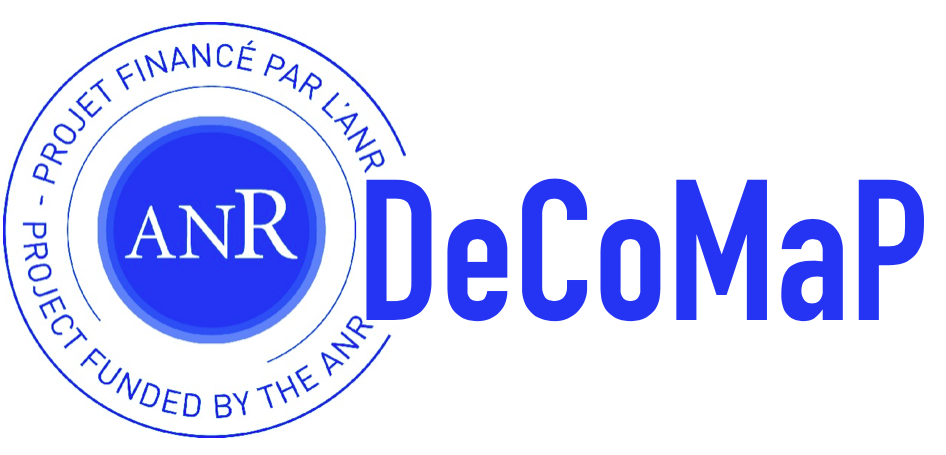

# **My DeCoMaP Journal**

This is a lab journaling of my works in DeCoMaP project. The DeCoMaP project uses all the available open data of the French public procurement markets. Thus, the BOAMP database (Bulletin Officiel des Annonces des Marchés Publics), the TED (european Tender Electronic Daily) and the DECP (Données Essentielles de la Commande Publique) are being used. This lab journaling website is a small open window on these amazing databases.

## The DeCoMaP Project in a nutshell

DeCoMaP lies at the intersection of these three considerations: regulatory developments, open data and automatic tools for fraud detection and economics analysis. Considering that public procurement data are essentially of a relational nature, we will noticeably use machine learning and graph-based approaches to model and automate fraud detection. As much by its field of inquiry (France) as by its methodology and as by its pluri-disciplinary approach, DeCoMaP is totally innovative.

### [DeCoMaP Official website](https://decomap.univ-avignon.fr)

